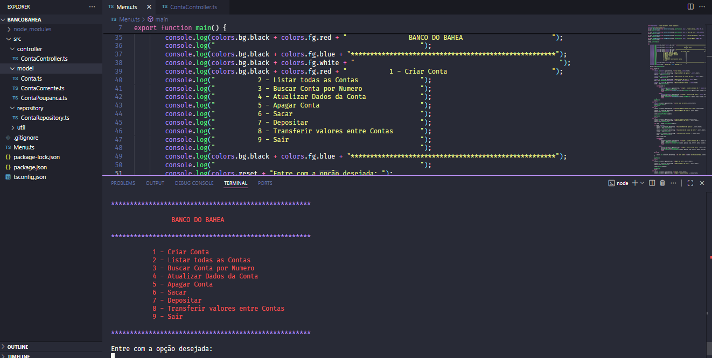

# 🏦 Banco do Bahea

Aplicação de terminal que simula um sistema bancário, desenvolvida em **Node.js/TypeScript** como parte do programa de formação **Full Stack JavaScript – Generation Brasil**.  
O projeto aplica conceitos de **Programação Orientada a Objetos (POO)** como **herança, polimorfismo, encapsulamento e classes abstratas**, além de uma arquitetura simples com **controller** e **repository**.

---

## 🚀 Funcionalidades
- Criar, listar, atualizar e remover contas (**CRUD**)
- Realizar **depósitos, saques e transferências** entre contas
- Menu interativo via terminal utilizando **readline-sync**
- Estrutura com **classe abstrata Conta** servindo como base para **ContaCorrente** e **ContaPoupanca**
- Saída colorida no terminal para melhor experiência do usuário (**utils/colors**)

---

## 🛠️ Tecnologias Utilizadas
- **TypeScript**
- **Node.js**
- **ts-node**
- **readline-sync**

---

## 📂 Estrutura do Projeto

src/
├── models/        # Classes e abstrações
│   ├── Conta.ts
│   ├── ContaCorrente.ts
│   └── ContaPoupanca.ts
│
├── controller/    # Lógica de controle
│   └── ContaController.ts
│
├── repository/    # Manipulação de dados
│   └── ContaRepository.ts
│
├── utils/         # Funções auxiliares
│   └── colors.ts  # Saída colorida no terminal
│
├── Menu.ts        # Menu principal
└── tsconfig.json, package.json, package-lock.json


---

📚 Aprendizados
Aplicação prática de POO com classes abstratas, herança e polimorfismo

Organização em camadas (Model, Controller, Repository e Utils)

Interação com o usuário via linha de comando

Implementação de operações bancárias simuladas

Uso de cores no terminal para destacar informações

## ▶️ Como executar o projeto
```bash
# Clone o repositório
git clone https://github.com/gabrielmessias-dev/bancobahea.git

# Entre na pasta do projeto
cd bancobahea

# Instale as dependências
npm install

# Execute o app
npx ts-node Menu.ts
```
📸 Demonstração




📚 Aprendizados

Aplicação prática de POO com classes abstratas, herança e polimorfismo

Organização em camadas (Model, Controller, Repository e Utils)

Interação com o usuário via linha de comando

Implementação de operações bancárias simuladas

Uso de cores no terminal para destacar informações

👨‍💻 Autor

Gabriel Messias


